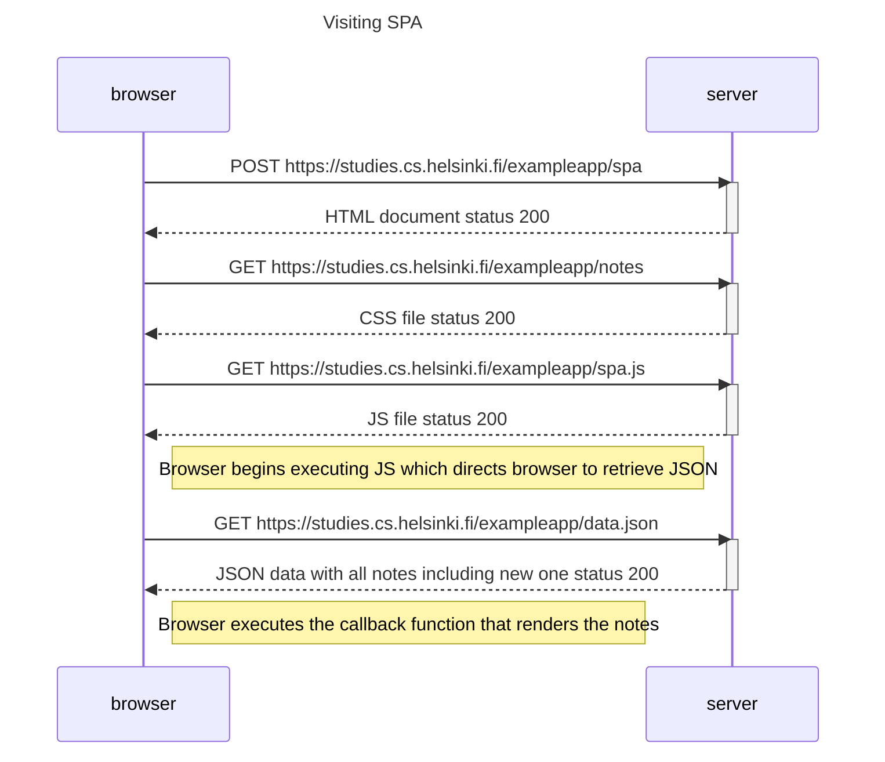

```mermaid
sequenceDiagram
  title Visiting SPA

  participant browser
  participant server

  browser->>server: POST https://studies.cs.helsinki.fi/exampleapp/spa
  activate server
  server-->>browser: HTML document status 200
  deactivate server

  browser->>server: GET https://studies.cs.helsinki.fi/exampleapp/notes
  activate server
  server-->>browser: CSS file status 200
  deactivate server

  browser->>server: GET https://studies.cs.helsinki.fi/exampleapp/spa.js
  activate server
  server-->>browser: JS file status 200
  deactivate server

  Note right of browser: Browser begins executing JS which directs browser to retrieve JSON

  browser->>server: GET https://studies.cs.helsinki.fi/exampleapp/data.json
  activate server
  server-->>browser: JSON data with all notes including new one status 200
  deactivate server

  Note right of browser: Browser executes the callback function that renders the notes
```